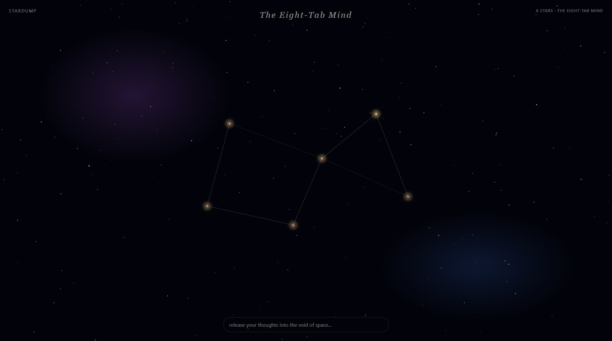
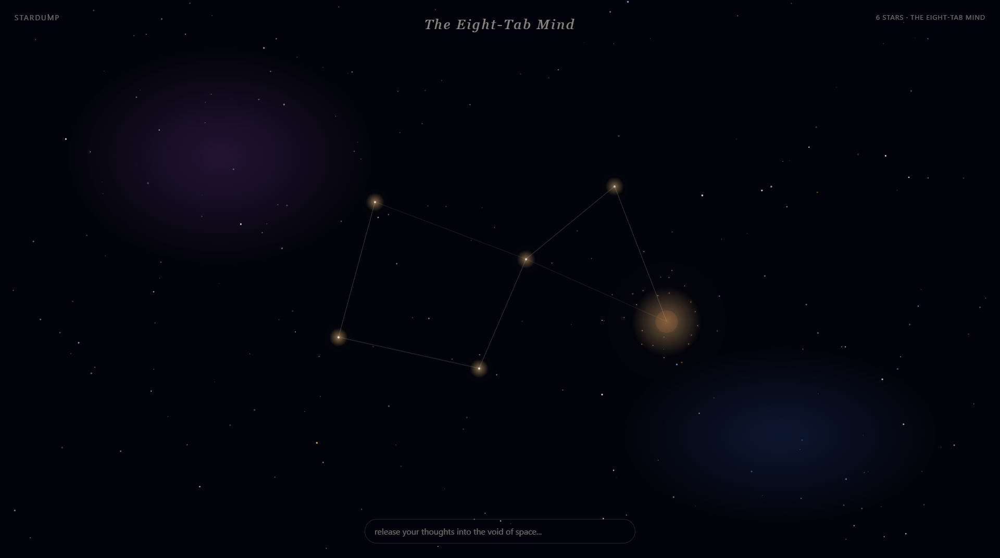

<div align="center">

# ✦ Stardump

### Turn your worries into stars — then let them go supernova.

*A quiet corner of space where you set your thoughts down, watch them become a constellation that's yours, and resolve them with a burst of light.*

<br>

[**🌌 Open the live app →**](https://gamingokil.github.io/Stardump/)

<br>


<br>



<br>

</div>

---

## What is Stardump?

Stardump is a single-page web app for releasing the small anxieties rattling around in your head. You type a worry, it becomes a **twinkling star** in an endless night sky. Five stars link into a **procedurally-named constellation** — your personal map of what's on your mind. When a worry passes, you tap its star and it goes **supernova**: a slow, satisfying burst of light, and it's gone.

No accounts. No backend. No tracking. Everything lives in your browser. Just you and the void. 🌌

<div align="center">

### **[→ Try it now at gamingokil.github.io/Stardump](https://gamingokil.github.io/Stardump/)**

</div>

---

## How it works

<table>
<tr>
<td width="50%" valign="top">

### ① Land a thought
Type a worry into the bar and hit **Enter**. It drops into the sky as a glowing, twinkling star — placed gently so it never overlaps the others.

</td>
<td width="50%" valign="top">

### ② Form a constellation
At **five stars**, faint lines connect your sky and a name appears at the top — *The Eight-Tab Mind*, *The Sleepless Cipher*, *The Unread Group Chat* — drawn from the words in your worries.

</td>
</tr>
<tr>
<td width="50%" valign="top">

### ③ Let it go supernova
Click a star, read it back, and **mark it resolved**. It erupts in a warm burst of light and particles, then fades to nothing. Closure, rendered.

</td>
<td width="50%" valign="top">

### ④ Drift through your sky
The canvas is endless. **Drag** to pan across your stars, **scroll** to zoom, and **double-click** anywhere to glide back to center.

</td>
</tr>
</table>

<div align="center">

| Your constellation, named | The supernova moment |
|:---:|:---:|
|  |  |

*Your sky restores exactly as you left it on every visit.*

</div>

---

## ✨ Features

- **🌟 Worries → stars** — every thought becomes a twinkling point of light with a soft parallax drift.
- **🔭 Auto-named constellations** — five stars trigger connecting lines and a name generated from your own words, with playful fallbacks like *2AM Drift* and *Sunday Scaries*.
- **💥 The supernova** — the centerpiece. A slow scale-and-hue bloom with radiating particles when you resolve a worry.
- **🪐 Endless canvas** — pan, zoom, and recenter across a parallax starfield that never ends.
- **💾 Remembers you** — your whole sky persists in `localStorage`; close the tab and come back anytime.
- **🔒 Fully private** — zero network calls, zero accounts, zero analytics. Nothing ever leaves your browser.
- **🌠 Surprise favicons** — a different galaxy in your browser tab on every load.

---

## 🛠️ Built with intent

Stardump is **one `index.html` file** — all HTML, CSS, and JavaScript inline. No frameworks, no npm, no build step, no CDN. Just modern vanilla web platform:

| | |
|---|---|
| **Rendering** | Canvas 2D starfield · SVG constellation lines · CSS keyframe animations |
| **State** | `localStorage` (key: `stardump-v1-sky`) |
| **Motion** | `requestAnimationFrame` parallax loop · custom easing curves |
| **Dependencies** | **None.** Deliberately. |

That constraint is the point: it loads instantly, runs offline, and is the whole app in a file you can read top to bottom.

---

## 🚀 Run it locally

It's a static file — no install, no toolchain.

```bash
# Clone
git clone https://github.com/GaminGokil/Stardump.git
cd Stardump

# Option A: just open it
open index.html        # macOS  (Windows: start index.html)

# Option B: serve it (so localStorage behaves like production)
python3 -m http.server
# → visit http://localhost:8000
```

Best experienced on **desktop at full screen** — the supernova is worth it.

---

## 🌌 Try saying...

Stardump names your constellation from the themes it spots in your worries. A few to test it:

> *"i have an exam tomorrow and i haven't studied"* → school
> *"my friends left me on read in the group chat"* → social
> *"it's 3am and i still can't sleep"* → sleepless

School **+** social? You'll unlock **The Eight-Tab Mind**. 🧠

---

<div align="center">

Made with starlight for [**Hack Club**](https://hackclub.com/) · Licensed under [MIT](LICENSE)

**[gamingokil.github.io/Stardump](https://gamingokil.github.io/Stardump/)**

</div>
